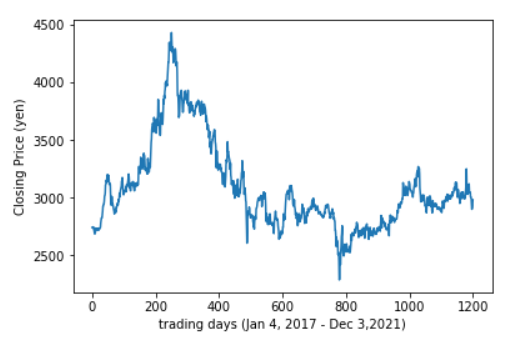
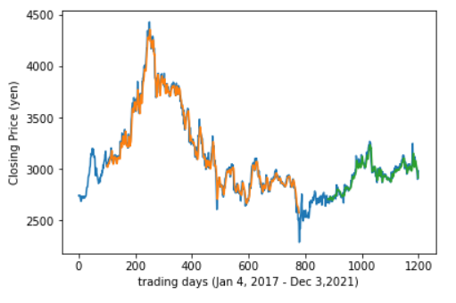
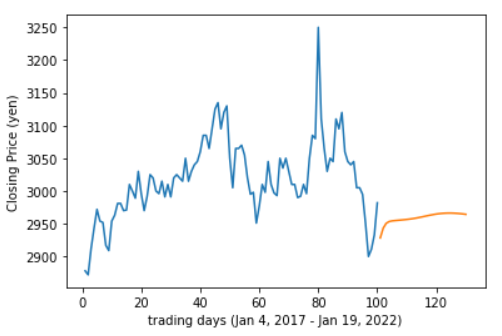
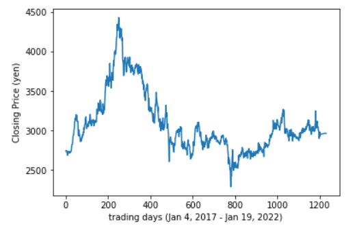

# Example of how the Stacked LSTM Works
## Download and clean real Tokyo Stock Exchange data
Approximatley four years of stock price data is downloaded, cleaned and then loaded into a datafile.  Below is a graph showing the closing price versus trading days of of Tokyo Stock Exchange (TSE) security 1301, Kyokuyo Co., LTD.  KYOKUYO is a Japan-based company primarily engaged in food business. The company operates in six business segments: 1) marine product purchasing, processing and salses,  2) frozen foods, 3) room temperature food products, 4) refrigerated warehouses, 5) a tuna fishery and 6) an insurance agency business.
 

## Training the model
A Stacked LSTM model using approximately 50,000 parameters is fitted on the data.  Below is a graph showing the actual stock data (blue) and the trained data used in the model (orange and green).  

## Making a prediction
Once the model is fitted to the data, it can be used to predict the prices of the stock in the future.  Below is a graph showing a prediction of Kyokuyo's closing prices 30 days beyond the end of the actual data.  

Adding the prediction data to the actual stock data smooths the data and shows how the predictions of the model seem reasonable.

